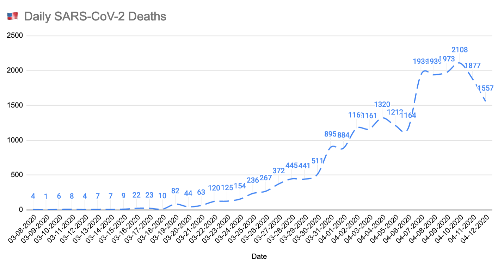

# COVID-19 Daily US data aggregator

You can check my [US Data spreadsheet](https://docs.google.com/spreadsheets/d/1ClwG2FKio0xnAolBY6gnO1fMKWyXAqaqavL3EjkXA-s/edit?usp=sharing)

John Hopkins University COVID-19 daily dead are granularly reported by county or state.

Maybe it's just me, but I like to see the whole picture for the United States.

This will add up all the numbers from each daily .csv and then print an output csv to stdout.

This way you can easily graph a time series of the total deaths in the US.

It will also calculate dead acceleration (K, period=7) to plug into exponential or logistic functions on the last column.

CSV Data has been obtained from Johns Hopkins University (JHU) Gitlab Repo:
https://github.com/CSSEGISandData/COVID-19/tree/master/csse_covid_19_data/csse_covid_19_daily_reports
